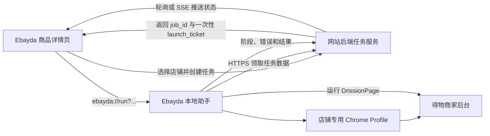
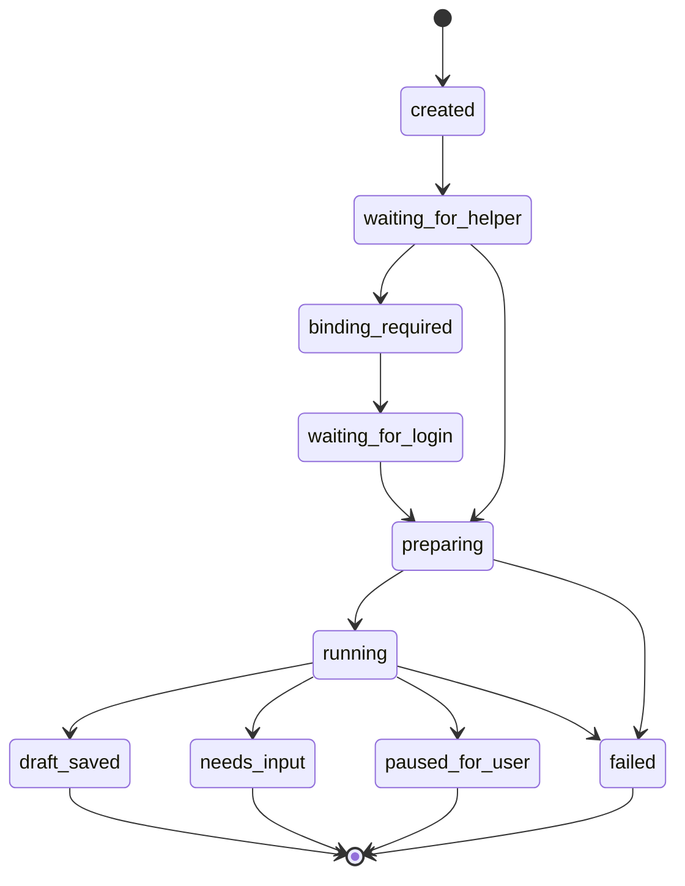

# 得物自动上架网站与本地助手集成设计

日期：2026-08-02
状态：已完成方案讨论，等待用户审阅

## 1. 最终产品形态

最终交付物不是一个需要用户手动打开的孤立 EXE，也不是浏览器插件，而是一套组合产品：

| 产物 | 用户看到的形态 | 职责 |
| --- | --- | --- |
| Ebayda 网站功能 | 商品详情页中的“自动上架到得物”按钮、店铺选择弹窗、绑定状态和任务进度 | 选择商品与店铺、创建任务、展示结果 |
| 网站后端任务服务 | 用户不可见的 API 和任务状态存储 | 鉴权、生成一次性唤起凭证、提供商品数据、接收任务进度 |
| Ebayda 本地助手 | 一键安装包 `EbaydaHelperSetup.exe`，安装后由网站自动唤起 | 管理店铺专用 Chrome Profile、领取任务、运行现有 DrissionPage 自动化、回传结果 |
| 使用与运维材料 | 安装说明、店铺绑定说明、版本发布记录和测试报告 | 支持部署、升级和问题定位 |

用户日常主要停留在 `https://www.ebayda.com/products/{id}`。本地助手是后台执行能力，只在首次安装、首次绑定、登录过期或异常时展示界面。

第一版按 Windows 10/11 设计，使用用户已安装的 Google Chrome。若以后支持 macOS，再提供 `.app/.dmg`，网站和后端协议不需要改变。

## 2. 目标与边界

### 2.1 目标

- 在商品详情页选择一个得物店铺并发起自动上架。
- 网站能安全唤起用户电脑上的本地助手。
- 复用当前 Python、DrissionPage、JSON 解析和图片 ZIP 处理能力。
- 每个得物店铺使用独立、长期保存的 Chrome Profile。
- 登录状态和凭证仅保存在用户电脑上。
- 自动化默认只填写并保存草稿，不提交审核。
- 页面能够显示实时阶段、成功结果和需要人工处理的原因。

### 2.2 第一版不做

- 不自动提交审核。
- 不批量选择多个店铺；一次任务只处理一个店铺。
- 不保存、上传或代填得物密码、Cookie、短信验证码和 Token。
- 不绕过滑块、验证码、设备校验或平台风控。
- 不直接调用得物未公开的登录或发布接口。
- 不直接接管 Chrome 默认用户数据目录中的日常 Profile。
- 不开发浏览器插件，不建设云浏览器或云 RPA。

## 3. 已确认的产品决策

1. 自动化运行在每位用户自己的电脑上。
2. 一次任务只选择一个得物店铺。
3. 用户在网站选择店铺后，网站自动唤起本地助手。
4. 本地助手使用店铺专用 Chrome Profile，而不是共享一个浏览器会话。
5. 首次绑定由用户人工完成密码、短信或扫码登录。
6. 登录过期时暂停任务、打开登录页，用户重新登录后自动继续。
7. 第一版继续使用 DrissionPage，不为复用日常 Chrome Profile 重写为浏览器扩展。

## 4. 总体架构



浏览器协议只承担“唤起助手”，不承载完整商品 JSON、图片或登录信息。

推荐协议格式：

```text
ebayda://run?job_id=<opaque-id>&ticket=<single-use-ticket>
```

`ticket` 必须单次使用、最长 120 秒过期，并绑定当前用户、商品、店铺和操作类型。助手使用它通过 HTTPS 领取真实任务数据。

## 5. 用户流程

### 5.1 首次安装

1. 用户在商品页点击“自动上架到得物”。
2. 网站尝试打开 `ebayda://` 协议。
3. 若助手未安装，页面显示下载入口。
4. 用户运行 `EbaydaHelperSetup.exe`，完成当前用户级的一键安装。
5. 安装程序注册 `ebayda://` 协议，并创建本地应用数据目录。
6. 用户返回商品页再次点击按钮；Chrome 弹出“是否打开 Ebayda 助手”。

安装应尽量不要求管理员权限。第一版不需要常驻托盘；助手按任务唤起并使用单实例锁避免重复运行。

### 5.2 首次绑定店铺

1. 商品页弹窗从网站现有店铺数据中列出得物店铺。
2. 用户选择一个显示“未绑定到此电脑”的店铺。
3. 网站创建绑定任务并唤起助手。
4. 助手按 `shop_id` 创建长期保存的专用 Chrome Profile。
5. 助手打开得物商家后台登录页。
6. 用户使用密码、短信验证码或“得物商家版 App”扫码登录。
7. 若登录后出现主账号或子账号列表，用户选择正确账号。
8. 助手读取页面可见的店铺名称或非敏感商家标识，与所选店铺进行确认。
9. 验证成功后，本地保存 `shop_id → Profile 目录` 映射，网站保存设备绑定状态和最后验证时间。
10. 商品页显示“已绑定”，用户可继续当前上架任务。

### 5.3 日常自动上架

1. 用户打开商品详情页并点击“自动上架到得物”。
2. 用户选择一个已绑定店铺。
3. 网站创建任务并唤起助手。
4. 助手领取归一化商品数据和签名媒体下载地址。
5. 助手打开该店铺固定的 Chrome Profile。
6. 若登录有效，执行数据预检、创建新品申请、填写详情并保存草稿。
7. 助手持续回传阶段和可见校验错误。
8. 网站显示“草稿已保存”或“需要人工处理”，并提供得物草稿页面位置。

### 5.4 登录过期

1. 助手发现得物页面跳转到登录页，或目标页面和关键按钮不存在。
2. 任务进入 `waiting_for_login`，不继续填写。
3. 助手将登录窗口置于前台，并推荐用户使用商家版 App 扫码。
4. 用户也可以使用手机号密码或短信验证码登录。
5. 助手只检测登录成功后的页面状态，不读取登录输入内容。
6. 登录成功后继续原任务；遇到滑块、验证码、设备验证或风控提示时继续等待人工处理。

## 6. 店铺专用 Chrome Profile

Chrome Profile 是包含 Cookie、Local Storage、登录状态和浏览器设置的一份独立用户数据目录。它不是无痕窗口，也不是每次任务新建的临时目录。

示例本地结构：

```text
%LOCALAPPDATA%\EbaydaHelper\
├── config.json
├── logs\
└── profiles\
    ├── shop_101\
    ├── shop_102\
    └── shop_103\
```

设计规则：

- 一个得物店铺对应一个长期 Profile。
- Profile 必须放在应用数据目录，而不是 EXE 安装目录，升级程序不能删除登录状态。
- 网站不保存本地目录路径；本地助手按 `shop_id` 查找目录。
- 不复制日常 Chrome Profile，不提取或迁移其 Cookie。
- 同一时刻只允许一个店铺任务占用自动化浏览器。
- 自动化开始前必须重新确认当前得物店铺身份，防止串号。

当前项目的 `.chrome-profile` 已经是一份专用 Profile，只是所有任务共用一份。正式版本将其改为按 `shop_id` 分目录，并移出项目目录。

从 Chrome 136 开始，`--remote-debugging-port` 不能用于默认 Chrome 用户数据目录。使用系统 Chrome 加自定义 `--user-data-dir` 可以继续支持 DrissionPage，同时不接触用户日常 Profile。

参考：[Chrome 远程调试开关安全变更](https://developer.chrome.com/blog/remote-debugging-port)。

## 7. 得物登录策略

当前得物商家后台公开登录模块支持：

- 手机号 + 密码登录；
- 手机号 + 短信验证码登录；
- “得物商家版 App”扫码登录；
- 登录后选择主账号或子账号。

参考：[得物商家后台](https://stark.dewu.com/)。

虽然支持密码登录，第一版仍不允许助手保存密码或调用内部登录接口。密码登录可能触发滑块、短信二次验证、设备校验或其他风控，无法作为可靠的无人值守能力。

推荐顺序：

1. 首次绑定或会话过期时优先扫码登录；
2. 用户自行选择短信或密码登录；
3. 浏览器密码管理器可以由用户自行使用，但助手不读取或控制保存的密码；
4. 所有验证码和风控动作由用户完成；
5. 登录成功后助手自动恢复任务。

## 8. 系统组件

### 8.1 网站前端

在商品详情页增加：

- “自动上架到得物”按钮；
- 单选店铺弹窗；
- 本地助手状态：未安装、已连接、版本过低；
- 店铺状态：未绑定、已绑定、登录过期、任务运行中；
- 任务进度：准备数据、打开店铺、填写基础信息、填写销售规格、上传图片、保存草稿；
- 结果区域：草稿已保存、需要输入、已暂停、失败；
- 明确提示“本次不会提交审核”。

页面不直接连接 Chrome，也不把产品大数据塞入自定义协议 URL。

### 8.2 网站后端

后端负责：

- 校验当前用户是否有权访问商品和店铺；
- 创建设备绑定和自动化任务；
- 生成一次性 launch ticket；
- 将网站商品数据转换为助手需要的稳定任务负载；
- 为图片 ZIP 或单张媒体生成短期签名下载地址；
- 接收助手回传的阶段、错误和最终结果；
- 为前端提供任务状态查询或 SSE 推送；
- 保证同一用户、店铺和商品的重复点击不会产生并发重复任务。

### 8.3 本地助手

本地助手由当前 Python 项目演进而来，包含：

- `ebayda://` 协议处理器；
- 一次性任务领取与校验；
- 本地设备标识和安全存储；
- 店铺 Profile 管理；
- Chrome 启动、激活和单实例控制；
- 现有 JSON、ZIP 和媒体预检；
- 现有 DrissionPage 起始页和详情页自动化；
- 登录状态检测和人工接管提示；
- 结构化阶段、错误和结果回传；
- 启动时版本检查和“请下载新版”的升级提示。

第一版优先使用 PyInstaller 将 Python、DrissionPage 和项目代码打入助手安装包，继续依赖系统已安装的 Google Chrome，不额外捆绑浏览器。

## 9. 最小数据模型

### 9.1 `automation_devices`

- `id`
- `user_id`
- `display_name`
- `public_key` 或设备认证标识
- `app_version`
- `last_seen_at`
- `status`

### 9.2 `shop_automation_bindings`

- `shop_id`
- `device_id`
- `status`: `unbound | binding | bound | login_expired | disabled`
- `verified_account_label`
- `verified_at`
- `last_used_at`

不保存 Profile 路径、Cookie、密码或验证码。

### 9.3 `automation_jobs`

- `id`
- `user_id`
- `product_id`
- `shop_id`
- `device_id`
- `action`: 第一版固定为 `save_draft`
- `status`
- `current_stage`
- `result_payload`
- `error_message`
- `created_at`
- `started_at`
- `finished_at`

## 10. 最小 API 契约

接口名称可跟随网站现有后端规范调整，语义保持如下：

- `POST /api/automation/jobs`：创建绑定或上架任务，返回 `job_id` 和 `launch_url`。
- `POST /api/automation/jobs/{job_id}/claim`：助手用一次性 ticket 领取任务负载和媒体签名地址。
- `POST /api/automation/jobs/{job_id}/events`：助手回传阶段、警告、校验错误和最终结果。
- `GET /api/automation/jobs/{job_id}`：商品页读取任务状态。
- `POST /api/automation/shop-bindings`：助手完成店铺身份验证后更新绑定状态。
- `POST /api/automation/devices/register`：首次唤起时登记本机助手实例。

任务负载只包含执行当前商品草稿所需的数据，不提供任意 URL、任意命令或任意本地文件操作能力。

## 11. 任务状态



关键语义：

- `draft_saved`：捕获明确保存成功反馈，且没有阻止保存的错误。
- `needs_input`：商品资料不完整或页面校验要求用户补充。
- `paused_for_user`：登录、验证码、风控、权限或页面身份需要人工处理。
- `failed`：助手、下载、页面结构或其他非业务输入错误导致任务无法继续。

点击过按钮不等于任务成功，点击过“保存草稿”也不等于草稿已保存。

## 12. 异常处理

| 情况 | 产品行为 |
| --- | --- |
| 助手未安装 | 页面显示下载入口和安装说明，不创建可重复执行的后台任务 |
| 助手版本过低 | 阻止新任务，提示下载新版 |
| 店铺未绑定 | 自动进入首次绑定流程 |
| 登录过期 | 打开原店铺 Profile，等待用户重新登录后恢复任务 |
| 滑块、验证码、设备验证或风控 | 立即暂停，不尝试绕过 |
| Profile 已由同店铺窗口打开 | 激活受控窗口；无法确认时暂停，不另开错误店铺 |
| 另一个任务正在运行 | 页面显示“助手忙碌”，不并发执行 |
| 商品数据或图片下载失败 | 返回可重试错误，不打开得物页面 |
| 得物页面结构变化 | 停止操作并报告定位失败，不猜测元素、不提交 |
| 保存未出现成功反馈 | 返回 `not_saved` 或 `needs_input`，不声称成功 |
| 用户重复点击 | 使用幂等键复用未结束任务，不创建多个草稿 |

## 13. 安全与隐私

- 网站和助手之间只通过 HTTPS 与一次性 ticket 交换任务。
- ticket 单次使用、短时过期，并绑定用户、商品、店铺和动作。
- 自定义协议中不得包含密码、Cookie、长期 API Token、完整 JSON 或本地文件路径。
- 本地设备认证信息使用 Windows DPAPI 或同等级系统安全存储。
- 助手仅允许访问网站提供的受信任务接口和 `stark.dewu.com` 目标页面。
- 任务负载不能下发 shell 命令、Python 代码或任意浏览器 URL。
- 安装包和更新包应进行代码签名，降低 Windows SmartScreen 拦截和供应链风险。
- 继续使用当前 ZIP 路径越界、成员数量、单文件大小和总大小校验。
- 日志不得记录密码、Cookie、短信验证码、launch ticket 或完整授权请求头。
- 登录、验证码、风控和最终提交审核始终由用户控制。

## 14. 打包与发布

第一版推荐发布以下文件：

```text
EbaydaHelperSetup-1.0.0.exe
EbaydaHelper-安装与绑定说明.pdf 或网页帮助
EbaydaHelper-1.0.0-测试报告.md
```

安装包完成：

- 当前用户级安装；
- 注册 `ebayda://` 协议；
- 创建应用数据和日志目录；
- 创建卸载入口；
- 启动助手并验证协议；
- 保留所有店铺 Profile，普通升级不得删除数据。

第一版只做启动时版本检查和人工确认升级，不先建设复杂的静默自动更新系统。得物页面变化导致旧版本不可用时，后端可以设置最低助手版本并阻止继续执行。

## 15. 测试策略

### 15.1 离线自动测试

- 保留并扩展现有 `unittest` 测试。
- 测试商品 JSON 归一化、图片 ZIP 安全解压和媒体解析。
- 测试 deep link 参数解析、ticket 过期和单次领取。
- 测试 `shop_id → Profile` 隔离和单实例锁。
- 测试任务状态转换与重复点击幂等性。
- 测试日志敏感字段过滤。

### 15.2 安装与协议测试

- 全新 Windows 用户安装助手。
- 未安装、已安装、版本过低三种网页状态。
- Chrome 弹窗唤起助手。
- 卸载后协议失效且 Profile 数据的删除策略有明确提示。

### 15.3 浏览器集成测试

- 测试店铺首次绑定、扫码登录和主/子账号选择。
- 测试两个店铺的 Profile 不串号。
- 测试登录有效、登录过期、验证码和风控暂停。
- 使用低风险测试商品验证起始页、详情页、SKU、图片上传和保存反馈。
- 所有集成测试默认停在保存草稿，不点击提交审核。

## 16. 第一版验收标准

- 用户能从商品详情页单选一个得物店铺。
- 未安装助手时能获得明确下载和安装指引。
- 已安装时网站能通过系统确认弹窗唤起助手。
- 未绑定店铺能完成 Profile 创建、人工登录和身份验证。
- 已绑定店铺能重复使用同一 Profile 和登录状态。
- 登录过期时任务暂停，重新登录后能继续。
- 助手能从网站领取商品 JSON 和图片，运行当前 DrissionPage 流程。
- 页面能展示运行阶段和明确结果。
- 只有捕获成功保存反馈时才显示“草稿已保存”。
- 不保存或上传得物密码、Cookie、验证码和 Token。
- 程序中不存在提交审核操作。

## 17. 建议实施顺序

1. 将当前命令行脚本改造成可接收标准任务负载的本地执行核心。
2. 增加按 `shop_id` 管理的 Chrome Profile 和店铺身份校验。
3. 增加本地助手入口、单实例锁和 `ebayda://` 协议。
4. 在网站后端实现设备、绑定、任务和一次性 ticket。
5. 在商品详情页实现店铺弹窗、安装检测、绑定和任务进度。
6. 完成 Windows 安装包、代码签名、版本检查和端到端测试。

## 18. 方案结论

第一版应以“网站为主界面，本地助手为执行引擎”呈现：

- 用户购买和使用的是 Ebayda 网站中的“得物自动上架”功能；
- 用户只需首次安装一个轻量的 Ebayda 助手；
- 用户不需要手动下载 JSON、图片 ZIP 或运行命令行；
- 每个店铺首次绑定并登录一次，之后从网站一键执行；
- 登录过期、验证码和风控才需要用户回到浏览器处理；
- 第一版不做 Chrome 插件，不把账号会话迁移到服务器。

这条路线能最大程度复用当前项目，保持账号数据留在用户本机，同时把日常操作收敛到网站的一个按钮和一个店铺选择弹窗中。
